## **一、基础任务**

## 实验一  汇编程序的设计（一）

**一、实验目的**

1. 熟悉汇编程序设计的界面
2. 初步掌握8088/8086汇编程序的编程过程及常见的汇编指令

**二、实验器材及环境**

1. 器材：PC微机一台
2. 实验环境：MASM2015 （汇编语言编程、编译、调试Windows界面）

**三、实验原理**

**1.** **汇编程序设计过程：**汇编语言是一种低级语言，特点是灵活多变。

汇编语言程序设计的步骤是：

(1) 利用汇编指令编写程序（源程序的扩展名为“.asm”）

(2) 编译源程序生成目标程序（目标程序的扩展名为“.obj”）

(3) 连接生成可执行程序（可执行程序的扩展名为：“.exe”）

(4) 运行可执行程序。

**2.** **汇编程序设计的两种操作界面**

(1) DOS操作系统下用指令完成

实验环境

硬件：PC微机

软件：DOS系统、EDIT.COM、MASM.EXE、LINK.EXE、DEBUG.EXE

(2) Windows操作系统下用专门的应用软件完成

实验环境

硬件：PC微机

软件：MASM2015

**四、实验内容**

1. 拆字：将AL中存放的2位压缩的BCD码拆成2位非压缩的BCD码后分别放入BH，BL中。
   
   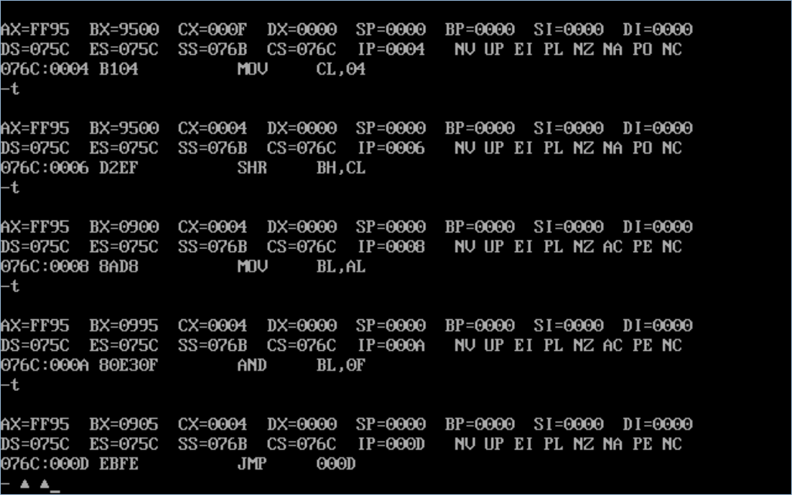
   
   ```assembly
   CODES SEGMENT
       ASSUME CS:CODES
   START:
      MOV AL,10010101B
      MOV BH,AL
      MOV CL,4
      SHR BH,CL
      MOV BL,AL
      AND BL,00001111B
   LL:JMP LL
   CODES ENDS
       END START
   ```
2. 合字：将BH，BL中存放的2位非压缩的BCD码合成2位压缩的BCD码放在AL中。
   
   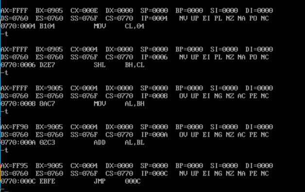
   
   ```assembly
   CODES SEGMENT
     ASSUME CS:CODES
   START:
     MOV BH,00001001B
     MOV BL,00000101B
     MOV CL,4
     SHL BH,CL
     MOV AL,BH
     ADD AL,BL
   LL:JMP LL
   CODES ENDS
     END START
   ```
3. 完成20×32的运算。
   
   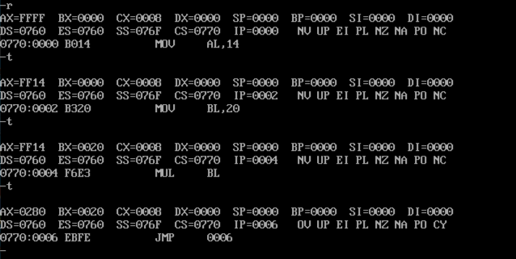
   
   ```assembly
   CODES SEGMENT
       ASSUME CS:CODES
   START:
       MOV AL,20
       MOV BL,32
       MUL Bl
   LL:JMP LL
   CODES ENDS
       END START
   ```
4. 将AL中高4位清零，低4位取反。

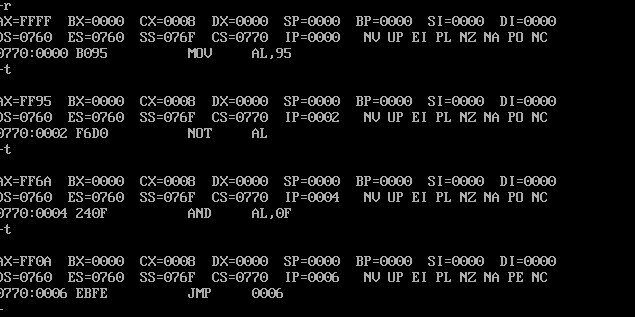

```assembly
CODES SEGMENT
    ASSUME CS:CODES
START:
   MOV AL,10010101B
   NOT AL
   AND AL,00001111B
LL:JMP LL
CODES ENDS
    END START
```

**五、实验步骤**

1. 在MASM2015编辑界面下编写程序；方法：打开MASM2015，在编辑界面下编写程序。
2. 保存源程序。方法：点击菜单栏保存，命名，扩展名为“.ASM” 。
3. 编译源程序。方法：点击“运行”菜单栏，选择第一个选项“编译生成目标文件（OBJ）”。
4. 生成“.EXE” 。方法：点击“运行”菜单栏，选择第二个选项“生成可执行文件（EXE）”。
5. 调试。方法：点击“运行”菜单栏，选择“调试”选项，接着：

R	↘          ；显示寄存器值

T    ↘          ；单步运行程序

Q   ↘          ；退出DEBUG环境

**六、思考题**

1. 本次实验中，汇编程序设计的两种界面各有什么特点？
   
   `DOS操作系统下是用指令完成代码编写，编译，链接，运行等操作的，编写代码，运行更高效`
   
   `Windows操作系统通过使用DOSBOX对DOS环境进行模拟，并提供了GUI界面，更加有好`
2. 汇编程序设计的格式是什么？
   
   `标号: 指令 操作数,操作数				;注释`

**七、实验心得**

`通过本次实验，我了解了DOS的基础用法，如何使用指令对代码文件（main.asm）进行编译，链接，运行`

`了解了汇编的基础编程方法，和指令运用，更深刻的体会到了汇编的魅力`

# 实验二  汇编程序的设计（二）

**一、实验目的**

1. 正确利用DEBUG调试汇编程序。
2. 了解汇编语言程序设计的结构。
3. 掌握存储器的读写过程。

**二、实验器材及环境**

1. 器材：PC微机一台
2. 实验环境：MASM2015 （汇编语言编程、编译、调试Windows界面）

**三、实验原理**

1. 汇编程序设计的基本结构有三种：顺序、分支、循环

（1）顺序结构：按照功能的要求从上到下顺序地编写程序的结构为顺序结构；

（2）分支结构：程序设计时，根据条件判断，不同结果分别执行不同的程序的结构形式称分支结构；

（3）循环结构：程序设计时反复地执行某一指令集合的程序结构为循环结构；

2. 微机内存按存取方式分RAM和ROM，静态RAM是RAM的一种。RAM是可读可写的，通过编程可以实现CPU读写存储器。

**四、实验内容**

1. 顺序结构程序设计：完成20×40的运算并将结果存在内存（2000H：1000H）中。
   
   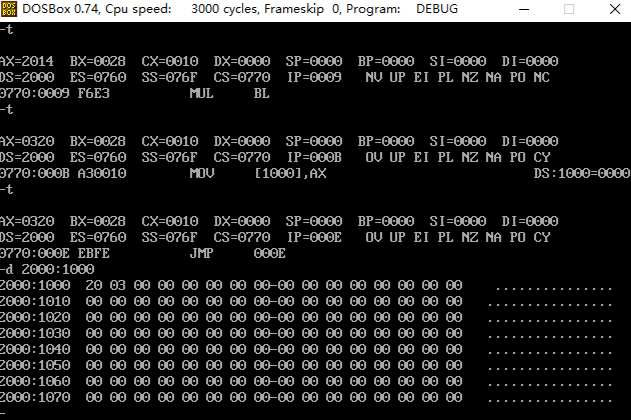
   
   ```assembly
   CODES SEGMENT
       ASSUME CS:CODES
   START:
      MOV AX,2000H
      MOV DS,AX
      MOV AL,20
      MOV BL,40
      MUL BL
      MOV DS:[1000H],AX
   LL:JMP LL
   CODES ENDS
       END START
   ```
2. 分支结构程序设计：比较内存单元（2000H：1000H）与（2000H：1050H）中的数据，相等给DL中送01H，不相等给DL中送FFH。
   
   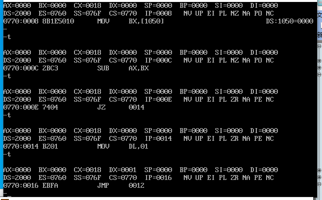
   
   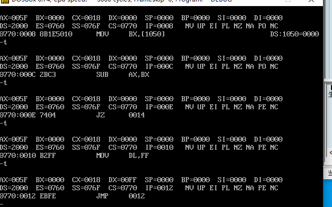
   
   ```assembly
   CODES SEGMENT
       ASSUME CS:CODES
   START:
      MOV AX,2000H
      MOV DS,AX
      MOV AX,DS:[1000H]
      MOV BX,DS:[1050H]
      SUB AX,BX
      JZ HH
      MOV DL,00FFH
   LL:JMP LL
   HH:
       MOV DL,0001H
       JMP LL
   CODES ENDS
       END START
   ```
3. 循环结构程序设计：将RAM（20000H~203FFH）中先写入数据55AAH，然后再读出来与55AAH比较，若写入的与读出的完全一致，则将AL置7FH否则将AL置81H。
   
   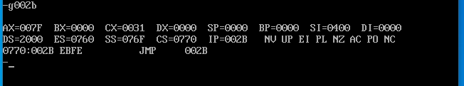
   
   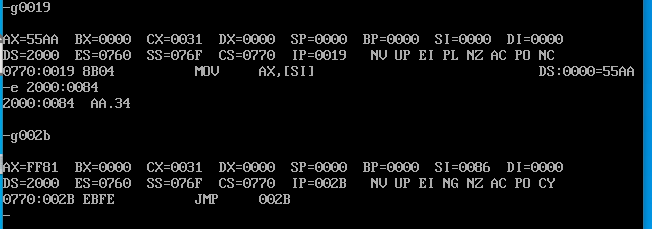

```assembly
CODES SEGMENT
    ASSUME CS:CODES
START:
   MOV AX,2000H
   MOV DS,AX
   MOV SI,0000H
CC:
    MOV AX,55AAH
    MOV DS:[SI],AX
    ADD SI,2
    CMP SI,03FFH
    JBE CC
    MOV SI,0000H
LQ:
    MOV AX,DS:[SI]
    ADD SI,2
    SUB AX,55AAH
    JNZ NQ
    CMP SI,03FFH
    JBE LQ
    MOV AL,7FH
LL:JMP LL
NQ:
    MOV AL,81H
    JMP LL
CODES ENDS
    END START
```

**五、实验步骤**

1. 在MASM2015编辑界面下编写程序；方法：打开MASM2015，在编辑界面下编写程序。
2. 保存源程序。方法：点击菜单栏保存，命名，扩展名为“.ASM” 。
3. 编译源程序。方法：点击“运行”菜单栏，选择第一个选项“编译生成目标文件（OBJ）”。
4. 生成“.EXE” 。方法：点击“运行”菜单栏，选择第二个选项“生成可执行文件（EXE）”。
5. 调试。方法：点击“运行”菜单栏，选择“调试”选项，接着：

R			↘          ；显示寄存器值

D 地址   ↘          ；显示内存单元内容

E 地址    ↘         ；修改内存单元内容

T            ↘          ；单步运行程序

G           ↘          ；全速运行程序

Q           ↘          ；退出DEBUG环境

**六、思考题**

1. 程序设计的基本结构有哪些？
   
   `顺序，分支，循环`
2. 调试软件中的指令应用应注意哪些？
   
   `-d和-e指令只能跟一个空格，多了会报错`
   
   `-go 如果不写程序中断，会持续执行，且没有显示`
3. 汇编程序中内存地址的表示方法有几种，如何表示。

`和寻址方式相同，先将内存地址给DS，有`

`DS:[1000H]`

`	DS:[SI]`

`	DS:2[SI]`

**七、实验心得**

`本次实验我学会了程序的基础编写规则（顺序，分支，循环），更加深入了解了汇编语言的编写`

`在实验中学习了如何使用DOSBOX查看特定内存的数值，和对其进行修改`

`学习了程序中断，-go执行语句，和-t n 多步执行`

# 实验三  输出接口实验

**一、实验目的**

1. 掌握微机系统对接口的寻址方式。
2. 掌握微机系统对接口的操作方法及使用方法。
3. 进一步掌握汇编语言编程。

**二、实验器材及环境**

1. 器材：PC微机一台
2. 实验环境：Proteus

**三、实验原理**

1. 端口的编址方式

（1）独立编址：存储器与端口分别编址的方式，特点是存储容量可以增大，但是访问存储器指令和端口须分别设置不同的指令；

（2）统一编址：存储器与端口统一编址的方式，特点是存储器与端口的地址不重复，不需要设置不同的指令；

2. 常见的接口设计

（1）设计输入接口：常用的输入接口需要在接入总线之前进行数据缓冲，需要接缓冲器。

（2）设计输出接口：常用的输出接口在输出给对象之前，需要进行锁存，即接锁存器，然后再接输出外设。

**四、实验内容**

已知端口地址为24H的接口外接8个指示灯，试使用锁存器以及译码器、门电路设计指示灯接口电路，并编程控制8个灯循环点亮（时间间隔可以通过延时自行决定）。

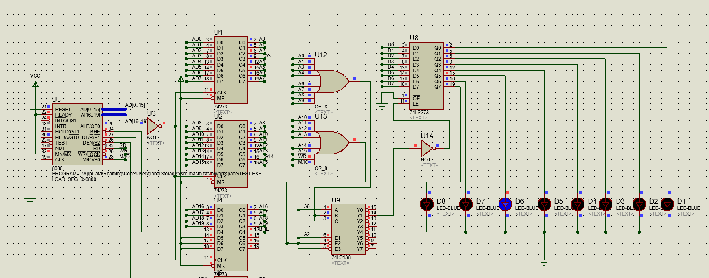

```assembly
STACT SEGMENT
             DW  100H DUP(0)    ; 栈空间
    StackTop EQU $ - 2
STACT ENDS
CODES SEGMENT
               ASSUME CS:CODES, SS:STACT
    Start:   
               MOV    SP, StackTop
               MOV    CX, 00FFFH
               MOV    AL, 00000001B
    MAIN_LOOP: 
               OUT    24H,AL
               CALL   Delay
               ROL    AL,1
               JMP    MAIN_LOOP
    Delay:   
               PUSH   CX
    Delay_Loop:
               NOP
               DEC    CX
               JNZ    Delay_Loop
               POP    CX
               RET
CODES ENDS
    END Start
```

**五、实验步骤**

1. 设计电路。
2. 在Protuse中绘制原理图。
3. 在MASM2015中编写序，保存源程序，汇编源程序，生成EXE文件。
4. 在Protuse中装载程序，调试。

**六、思考题**

1. 端口电路的设计中使用多少地址线？`19根`
2. 软件延时是如何实现的？`空循环`
3. 输出接口电路设计时一般需要进行什么处理？
   
   ` 使用译码电路产生片选信号`

**七、实验心得**

`本次实验将汇编更加实用化，使用8086运行汇编程序，进行输出，点亮小灯。`

# 实验四  接口综合实验

**一、实验目的**

1. 进一步掌握汇编语言程序设计。
2. 进一步掌握微机接口电路的设计与使用方法。

**二、实验器材及环境**

1. 器材：PC微机一台
2. 实验环境：Proteus

**三、实验原理**

1. 常见的接口设计

（1）设计输入接口：常用的输入接口需要在接入总线之前进行数据缓冲，需要接缓冲器。

（2）设计输出接口：常用的输出接口在输出给对象之前，需要进行锁存，即接锁存器，然后再接输出外设。

2.输入输出指令的使用

（1）端口输入指令 IN AL/AX，端口地址/DX

（2）端口输出指令 OUT 端口地址/DX，AL/AX

**四、实验内容**

1. 已知端口地址为24H的接口外接8个指示灯，试使用锁存器以及译码器、门电路设计指示灯接口电路；
2. 已知端口地址为26H的接口外接8个按键，试使用缓冲器以及译码器、门电路设计按键接口电路；
3. 编程控制8个灯显示按键的状态，按键闭合对应的灯亮，否则灯灭。

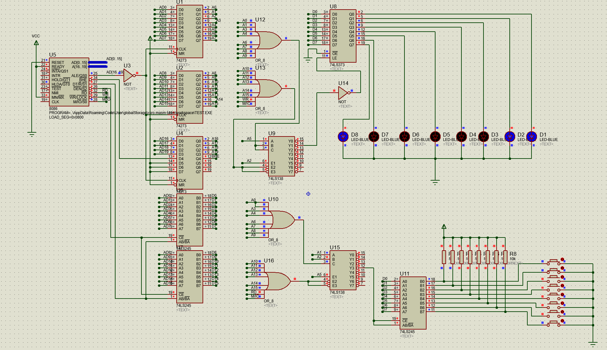

```assembly
CODES SEGMENT
          ASSUME CS:CODES
    ; 主程序
    Start:
          IN     AL,26H
          NOT    AL
          OUT    24H,AL
          JMP    Start
CODES ENDS
      END Start
```

**五、实验步骤**

1. 设计电路。

2.在Protuse中绘制原理图。

3.在MASM2015中编写程序，保存源程序，汇编源程序，生成EXE文件。

4.在Protuse中装载程序，调试。

**六、思考题**

1. 端口电路的设计中使用多少地址线？`19根`
2. 软件延时是如何实现的？`空循环`
3. 输出接口电路设计时一般需要进行什么处理？` 使用译码电路产生片选信号`

**七、实验心得**

`本次实验将汇编更加实用化，使用8086运行汇编程序，对输入信号进行处理然后输出，点亮小灯。`

# 实验五 流水灯实验

**一、实验目的**

1. 熟悉51单片机I/O口使用方法；
2. 熟悉C51编程的方法，进一步掌握逻辑运算指令及移位指令的使用；

**二、实验内容**

1. 熟悉C语言编程；
2. 编写程序，点亮LED；
3. 利用循环左移指令，使P1口8个LED轮流点亮，每个LED灯点亮时间约为0.5秒；
4. 掌握电路工作原理图，见“实验五 实验原理图”；
   
   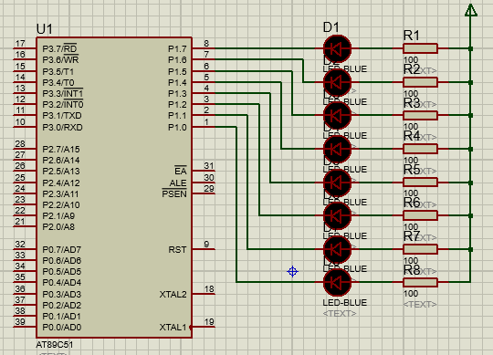

实验五 实验原理图

**三、实验器材**

电脑一台，51单片机口袋实验板1套；

**四、实验步骤**

1. 打开KEIL编程软件，第一步新建工程，第二步新建源文件（注文件扩展名为.C），第三步加载源文件，第四步设置生成.EXE文件，第五步编写程序，第六步编译。
2. 连接实验板，将通信线与电脑USB接口相连；
3. 打开电脑端下载程序应用程序，加载.HXE文件，点击“下载”；
4. 观察现象，调试程序。
5. 实验结束后，整理试验台。
   
   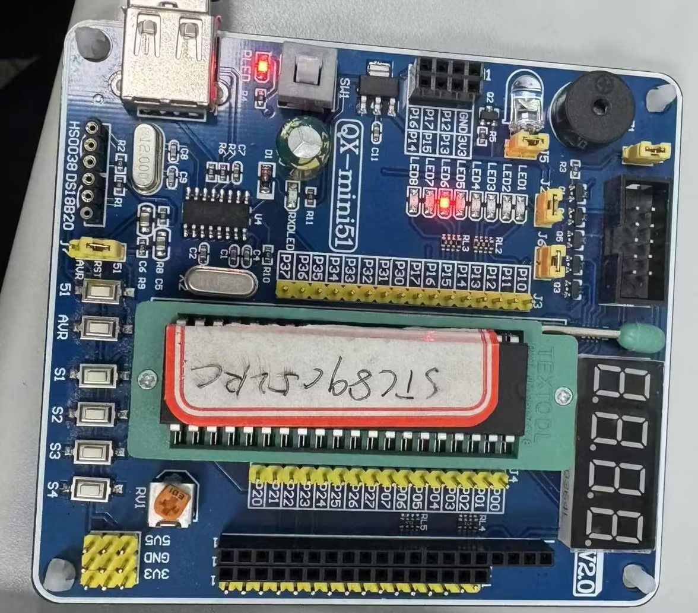
   
   ```c
   //流水灯正常阻塞函数
   #include <8051.h>
   unsigned char t = 8;
   __sfr __at 0x90 led; 
   
   void delay(unsigned int i){
       unsigned char j = 125;
       while (i--){
           j = 125;
           while (j--);}}
   void main(){
       while (1){
           led = 0xfe;
           while (t--){
               delay(500);
               led = led << 1 | 1;}
           t = 8;}}
   ```

```c
//流水灯定时器计时延迟1s
#include <8051.h>
#include <stdbit.h>
#define USER_TH0 15536/256
#define USER_TL0 15536%256
__sfr __at 0x90 led;
uint8_t i = 0;
uint8_t t = 8;
void Init_Timer(){
    TMOD = 0b00000001; // 设置定时器0为方式1 ,定时器1为方式2
    TH0 = USER_TH0;    // 设置定时器初始值
    TL0 = USER_TL0;    // T0中断值
    EA = 1;  // 允许总中断
    ET0 = 1; // 允许定时器0中断
    TR0 = 1; // 启动定时器T0
    led = 0xfe;}
void Timer0_ISR() __interrupt(1){
    TH0 = USER_TH0;
    TL0 = USER_TL0;
    i++;
    if (i == 20){i = 0;led = led << 1 | 1;t -= 1;
        if (t <= 0){led = 0xfe;t = 8;}}}
void main(){
    Init_Timer();
    while (1);}
```

**五、实验中应注意的问题**

1. 文件的扩展名必须为.c，文件名不可为汉字；
2. 必须在编译完程序后才可执行程序；
3. 注意线路连接要正确。
4. 连线时应注意不带电操作。

**六、** **思考题**

1．如何实现8个LED灯复杂点亮？

`将想要点的IO口拉低`

2．请思考下，如何实现8个LED灯循环右移？

`将led = led << 1 | 1;替换为led = led >> 1 | 0b10000000`

**七、心得体会**

`本次实验中将仿真化为现实，体会到了在protues仿真和实际使用C51单片机的不同。`

`实验中使用了16位时钟定时器，进行定时以获得更加精准的延时，使用了定时器累加20次的方法，实现了1s的计时。`

# 实验六 外部中断实验

**一、实验目的**

1.掌握外部中断的使用方法；

2.锻炼学生的动手能力和实际应用能力。

**二、实验内容**

1.阅读本次实验各项内容，熟悉实验电路图，了解各仪器仪表的使用方法。

2.关于中断的几个控制寄存器各位具体意义的复习。

3.分析电路工作原理图，见“实验六 硬件连接”图。

4.编写程序实现：没有键按下时，P1口接的LED循环左移点亮，按下simple pulse时，进入中断，P1口接的LED灯全亮；松开simple pulse 时，执行完中断，返回先前操作继续执行。

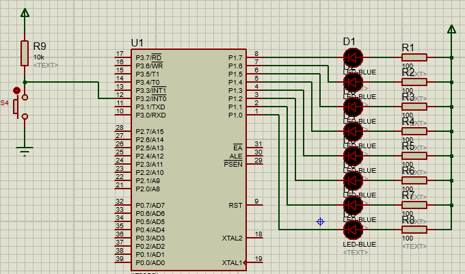

实验六 硬件连接

**三、实验器材**

1. 电脑一台,
2. 51单片机实验板一套。

**四、实验步骤**

1. 打开KEIL编程软件，第一步新建工程，第二步新建源文件（注文件扩展名为.C），第三步加载源文件，第四步设置生成.EXE文件，第五步编写程序，第六步编译。
2. 连接实验板，将通信线与电脑USB接口相连；
3. 打开电脑端下载程序应用程序，加载.HXE文件，点击“下载”；
4. 观察现象，调试程序。
5. 实验结束后，整理试验台
   
   
   
   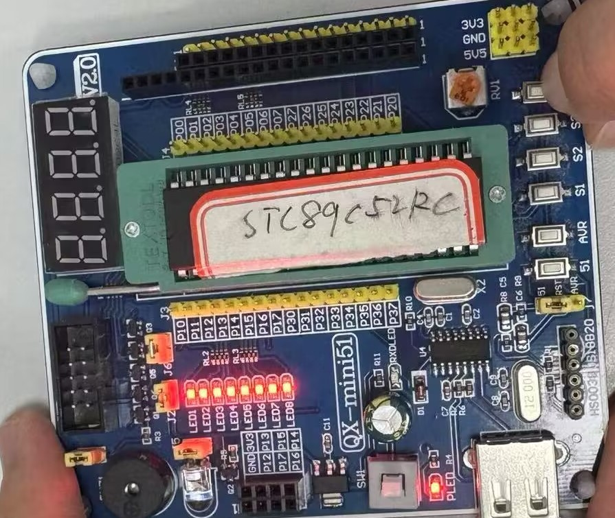
   
   ```c
   //单按键外部中断
   #include <8051.h>
   #include <stdint.h>
   __sfr __at 0x90 led;
   __sbit __at 0xb2 key;
   uint8_t t = 8;
   void Init_Interrupt(){
       EA = 1;
       EX0 = 1;
       IT0 = 1;}
   void INT0_interrupt() __interrupt(0){
       led = 0x00;
       while (!key);
       t = 0;}
   void delay(unsigned int i){
       unsigned char j = 125;
       while (i--){
           j = 125;
           while (j--);}}
   void main(){
       led = 0xfe;
       Init_Interrupt();
       while (1){
           led = 0xfe;
           while (t--){
               delay(500);
               led = led << 1 | 1;}
           t = 8;}}
   ```

```c
//按键开关机
#include <8051.h>
#include <stdint.h>
__sfr __at 0x90 led;
__sbit __at 0xb2 key;
uint8_t t = 8;
void Init_Interrupt(){
    EA = 1;
    EX0 = 1;
    IT0 = 1;}
void INT0_interrupt() __interrupt(0){
    led = 0x00;
    while (!key);
    t = 0;}
void delay(unsigned int i){
    unsigned char j = 125;
    while (i--){
        j = 125;
        while (j--);}}
void main(){
    led = 0xfe;
    Init_Interrupt();
    while (1){
        led = 0xfe;
        while (t--){
            delay(500);
            led = led << 1 | 1;}
        t = 8;}}
```

**五、实验注意事项**

1. 连线时应注意不带电操作。
2. 检查实验板上跳线是否正确。
3. 在单片机编程过程中，不要拔插单片机。
4. 必须在编译完程序后才可执行程序。

**六、思考题**

进入中断服务程序和中断返回时必须注意什么？

`① 视需要确定是否保护现场。 ② 及时清除那些不能被硬件自动清除的中断请求标志，以免产生错误的中断。 ③ 中断服务程序中的压栈与弹栈指令必须成对使用，以确保中断服务程序的正确返回。 ④ 主程序和中断服务程序之间的参数传递与主程序和子程序的参数传递方式相同。`

**七、心得体会**

`中断控制是计算机硬件和软件的重要组成部分，它在现代计算机系统中发挥着至关重要的作用。在我学习和实践中断控制过程中，我深刻体会到了中断控制的重要性和适当的处理方法。`

# 实验七  定时器实验

**一、实验目的**

1. 了解IO口输出的工作状态
2. 掌握定时器的应用

**二、实验内容**

1. 熟记C语言编程。
2. 根据实验目的将程序编写出来。
3. 利用定时器T0使P1.6口LED灯进行秒闪烁，P1.7口的灯进行分闪烁。
4. 熟悉电路工作原理图，见“实验七 实验原理图”。

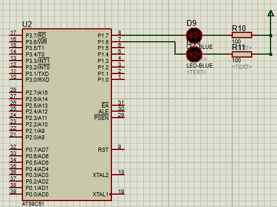

实验七 实验原理图

**三、实验器材**

电脑一台，51单片机实验板一套。

**四、实验步骤**

1. 打开KEIL编程软件，第一步新建工程，第二步新建源文件（注文件扩展名为.C），第三步加载源文件，第四步设置生成.EXE文件，第五步编写程序，第六步编译。
2. 连接实验板，将通信线与电脑USB接口相连。
3. 打开电脑端下载程序应用程序，加载.HXE文件，点击“下载”。
4. 观察现象，调试程序。
5. 实验结束后，整理试验台。
   
   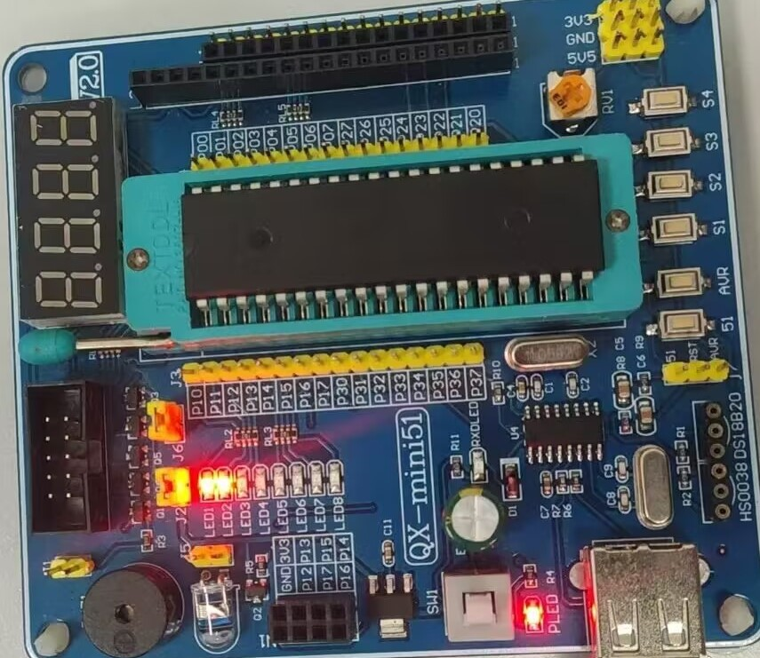
   
   ```c
   //led1 秒闪烁， led2 分闪烁
   #include <8051.h>
   #include <stdint.h>
   #define USER_TH0 19456 / 256
   #define USER_TL0 19456 % 256
   __sbit __at 0x96 led1;
   __sbit __at 0x97 led2;
   uint8_t i = 0;
   uint8_t t = 0;
   void Init_Timer(){
       TMOD = 0b00000001; // 设置定时器0为方式1 ,定时器1为方式2
       TH0 = USER_TH0;    // 设置定时器初始值
       TL0 = USER_TL0;    // T0中断值
       EA = 1;            // 允许总中断
       ET0 = 1;           // 允许定时器0中断
       TR0 = 1;           // 启动定时器T0
   }
   void Timer0_ISR() __interrupt(1){
       TH0 = USER_TH0;
       TL0 = USER_TL0;
       i++;
       if (i == 20){i = 0;t++;led1 = !led1;}
       if (t == 60){led2 = !led2;t = 0;}}
   void main(){
       led1 = 0;led2 = 0;
       Init_Timer();
       while (1);}
   ```
   
   ```c
   //带开关机的led1 秒闪烁， led2 分闪烁（按5次INT0）
   #include <8051.h>
   #include <stdint.h>
   #define USER_TH0 19456 / 256
   #define USER_TL0 19456 % 256
   __sbit __at 0x96 led1;
   __sbit __at 0x97 led2;
   uint8_t i,t,Ton;
   void Init(){
       TMOD = 0b01100001; // 设置定时器0为方式1 ,定时器1为方式2,计数
       TH0 = USER_TH0;    // 设置定时器初始值
       TL0 = USER_TL0;    // T0中断值
       EA = 1;            // 允许总中断
       ET0 = 1;           // 允许定时器0中断
       TR0 = 0;           // 启动定时器T0
       TH1 = 251;
       TL1 = 251;
       ET1 = 1; // 允许定时器1中断
       TR1 = 1; // 启动定时器T1
       EX0 = 1;
       IT0 = 1;}
   void Interrupt0() __interrupt(0){
       Ton++;
       if (Ton == 5){TR0 = 0;Ton = 0;led1 = 1;led2 = 1;}}
   void Timer0_ISR() __interrupt(1){
       TH0 = USER_TH0;
       TL0 = USER_TL0;
       i++;
       if (i == 20){i = 0;t++;led1 = !led1;}
       if (t == 60){led2 = !led2;t = 0;}}
   void Timer1_ISR() __interrupt(3){TR0 = 1;}
   void main(){
       led1 = 1;led2 = 1;
       Init();
       while (1);}
   ```

**五、实验中应注意的问题**

1. 文件的扩展名必须为.c，文件名不可为汉字。
2. 必须在编译完程序后才可执行程序。

**六、** **思考题**

1. 如果设计时晶振频率为12MHz，而实验板上实际晶振频率为11.0592MHz,显示时间比实际时间是偏大还是偏小？
   
   `时间和频率是反比关系。频率大的时间小.`
2. 更改定时器方式或者选用定时器1完成相应的程序。
   
   `更改TMOD到T1段，将TH0，TL0，IT0，ET0，TR0，改为TH1，TL1，IT1，ET1，TR1`

**七、心得体会**

`对定时器的原理和使用方法有了更深入的理解。定时器是嵌入式系统中常用的定时和计数器模块，通过这个实验，我了解了定时器的原理和使用方法，也掌握了如何编写定时器中断函数`

# 实验八 键控彩灯实验

**一、实验目的**

1. 掌握利用单片机I/O口的工作状态
2. 熟记C语言编程逻辑
3. 掌握键盘控制的方法，了解软件去抖动的方法

**二、实验内容**

1. 利用4个独立按键控制LED灯实现流水灯花样变换。
2. 根据实验目的将程序编写出来。
3. 电路工作原理图见图“实验八 实验原理图”。
   
   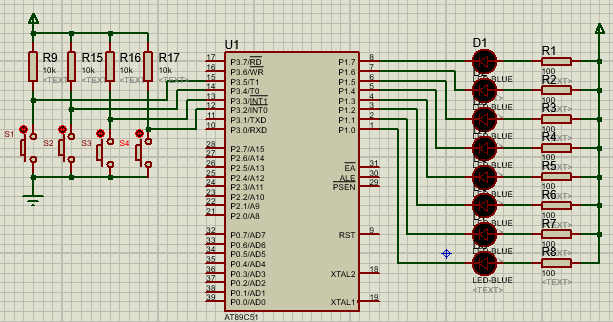

实验八 实验原理图

**三、实验器材**

电脑一台，51单片机实验板一套。

**四、实验步骤**

1. 打开KEIL编程软件，第一步新建工程，第二步新建源文件（注文件扩展名为.C），第三步加载源文件，第四步设置生成.EXE文件，第五步编写程序，第六步编译。
2. 连接实验板，将通信线与电脑USB接口相连。
3. 打开电脑端下载程序应用程序，加载.HXE文件，点击“下载”。
4. 观察现象，调试程序。
5. 实验结束后，整理试验台
   
   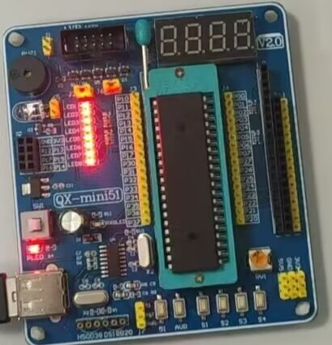
   
   ```c
   //按键花样灯（4中断版）
   #include <8051.h>
   #include <stdint.h>
   __sfr __at 0x90 led;
   uint8_t mode = 0;
   uint8_t t = 8;
   void Init(){
       TMOD = 0b01100110; // 设置定时器0为方式1 ,定时器1为方式2,计数
       TH0 = 255;         // 设置定时器初始值
       TL0 = 255;         // T0中断值
       EA = 1;            // 允许总中断
       ET0 = 1;           // 允许定时器0中断
       TR0 = 1;           // 启动定时器T0
       TH1 = 255;
       TL1 = 255;
       ET1 = 1; // 允许定时器1中断
       TR1 = 1; // 启动定时器T1
       // 外部中断
       EX0 = 1;
       IT0 = 1;
       EX1 = 1;
       IT1 = 1;}
   void END(){led = 0xff;mode = 0;t = 0;}
   void Interrupt0() __interrupt(0){
       if (mode == 1)	END();
       else{mode = 1;t = 0;}}
   void Interrupt1() __interrupt(2){
       if (mode == 2)	END();
       else{mode = 2;t = 0;}}
   void Timer0_ISR() __interrupt(1){
       if (mode == 3)`END();
       else{mode = 3;t = 0;}}
   void Timer1_ISR() __interrupt(3){
       if (led == 0x00){t = 0;mode = 0;led = 0xff;}
       else{t = 0;mode = 0;led = 0x00;}}
   void delay(uint16_t time){
       uint8_t i = 125;
       while (time--){
           i = 125;
           while (i--);}}
   void liu_led_L(){
       t = 8;led = 0xfe;
       while (t--){
           delay(200);
           led = led << 1 | 1;}}
   void liu_led_R(){
       t = 8;led = 0x7f;
       while (t--){
           delay(200);
           led = led >> 1 | 0b10000000;}}
   void liu_four_led(){
       t = 2;led = 0b11110000;
       while (t--){
           delay(500);
           led = led << 4 | 0b00001111;}}
   void Turn_ON(){led = 0xff;}
   void Turn_OFF(){led = 0x00;}
   void main(){
       Init();
       while (1){
           if (mode == 1)		liu_led_L();
           else if (mode == 2)	liu_led_R();
           else if (mode == 3)	liu_four_led();}}
   ```

**五、实验注意事项**

1. 文件的扩展名必须为.C，文件名不可为汉字。
2. 必须在编译完程序后才可执行程序。

**六、** **思考题**

1. 简述一下键盘软件去抖动的方法？`识别到按下后添加50~100ms延迟`
2. 程序如何实现多分支状态？`实验变量存储状态，扫描执行`

**七、心得体会**

`通过键控彩灯实验，我深入理解了硬件电路与编程逻辑的结合。实验中按键控制的实现让我掌握了消抖处理和长短按功能设计，灯光效果的调试提升了我的编程调试能力。此外，我体会到细致接线与耐心调试的重要性，尤其是在解决按键不灵敏和灯效异常问题时，逐步排查的方法尤为关键。本次实验不仅巩固了理论知识，还培养了实践能力，为后续的嵌入式开发奠定了基础。`

# 实验九 数码管动态显示实验

**一、实验目的**

1. 正确理解动态数码管显示电路的构成、工作原理和电路中各元器件的作用，并对电路进行分析；
2. 正确设计单片机应用系统的显示接口。

**二、实验内容**

1. 熟悉C语言编程；
2. 设计一个数码管动态显示电路，实现4个LED数码管分别显示“1234”四个数字，数码管为共阳极数码管。
3. 熟悉电路工作原理图，见“实验九 数码管原理图”。
4. 编写实验程序。
   
   

实验九 数码管原理图

**三、实验器材**

电脑一台，51单片机实验板一套。

**四、实验步骤**

1. 打开KEIL编程软件，第一步新建工程，第二步新建源文件（注文件扩展名为.C），第三步加载源文件，第四步设置生成.EXE文件，第五步编写程序，第六步编译。
2. 连接实验板，将通信线与电脑USB接口相连。
3. 打开电脑端下载程序应用程序，加载.HXE文件，点击“下载”。
4. 观察现象，调试程序。
5. 实验结束后，整理试验台。
   
   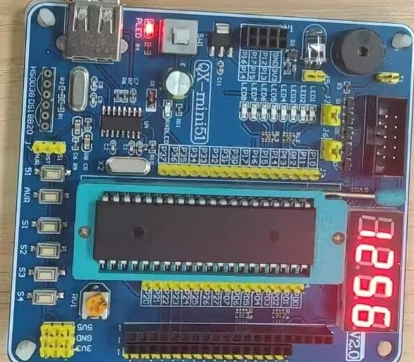
   
   ```c
   //数码管动态显示
   #include <8051.h>
   #include <stdbit.h>
   
   const uint8_t _7seg[] = {
       0xc0, 0xf9, 0xa4, 0xb0, 0x99, 0x92, 0x82, 0xf8, 0x80, 0x90};
   
   __sfr __at 0x80 dat;
   __sfr __at 0xa0 c;
   __sbit __at 0xa0 c1;
   __sbit __at 0xa1 c2;
   __sbit __at 0xa2 c3;
   __sbit __at 0xa3 c4;
   
   void delay(uint8_t time)
   {
       while (time--){
           for (uint8_t i = 125; i > 0; i--);
       }
   }
   
   void main()
   {
       uint16_t t = 1256;
       while (1){
           c = 0xff;
           c1 = 0;
           dat = _7seg[t / 1000];
           delay(5);
           c = 0xff;
           c2 = 0;
           dat = _7seg[t % 1000 / 100];
           delay(5);
           c = 0xff;
           c3 = 0;
           dat = _7seg[t % 100 / 10];
           delay(5);
           c = 0xff;
           c4 = 0;
           dat = _7seg[t % 10];
           delay(5);
       }
   }
   ```

**五、实验中应主意的问题**

1. 文件的扩展名必须为.c，文件名不可为汉字。
2. 必须在编译完程序后才可执行程序。

**六、** **思考题**

如何使用数码管采用定时器制作秒表？

`采用之前的分秒闪烁，直接将秒的值给t`

**七、心得体会**

`通过数码管动态显示实验，我掌握了动态扫描的基本原理，理解了多位数码管如何通过时分复用实现显示效果。实验中，我学习了定时器的使用，以及如何通过快速切换位选和段选实现稳定显示。在调试过程中，解决了显示闪烁和字符错误的问题，提升了硬件和软件结合调试的能力。实验让我认识到动态显示在资源节约和显示效率中的重要性，为今后开发多位显示应用打下了扎实的基础。`

# 实验十 单片机双机串行通信实验

**一、实验目的**

1. 了解51单片机串行通讯和全双工工作原理。
2. 掌握串行通讯的使用方法。
3. 进一步掌握C51编程方法。

**二、实验仪器**

1. 51单片机实验板1套；
2. 电脑一台

**三、实验预备知识**

1. 熟悉C语言编程
2. 根据实验目的将程序编写出来。

**四、实验内容**

1. 甲单片机P3.2、P3.3、P3.4、P3.5外接4个按键，P1口外接8个LED灯，乙机P1口外接8个LED灯。
2. 甲机检测按键，四个按键控制P1口4种花样点亮，同时将点亮的花样发送给乙机，乙机同步甲机点亮乙机P1口的8个LED灯。实验原理图见“实验十 原理图”。
3. 程序框图见图“实验十程序框图”。
   
   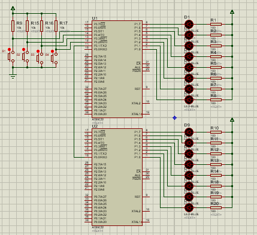

实验十 原理图

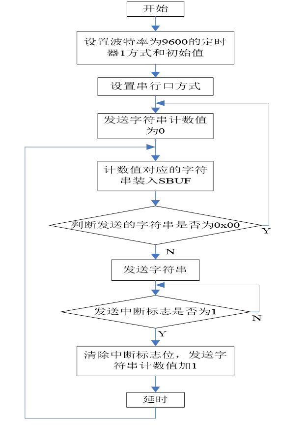

实验十 程序框图

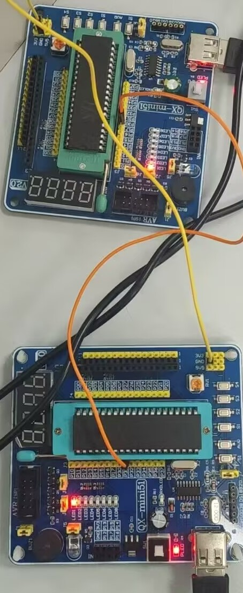

```c
//双机通信 TX = 1时为发生机 ，TX = 0时为接受机
#include <8051.h>
#include <stdbit.h>
#define TX 1
__sfr __at 0x90 led;
#if TX
__sbit __at 0xb2 KEY1;
__sbit __at 0xb3 KEY2;
__sbit __at 0xb4 KEY3;
__sbit __at 0xb5 KEY4;
uint8_t t = 8,temp,mode;
void delay(uint16_t time){
    uint8_t i = 125;
	while (time--){
        i = 125;
        while (i--);}}
void Init(){
    TMOD = 0x20;
    TH1 = 0xfd;
    TL1 = 0xfd;
    SCON = 0x40;
    PCON = 0x00;
    TR1 = 1;
    P1 = 0xff;}
void SerPO(){
    SBUF = led;
    while (TI == 0);
    TI = 0;}
void liu_led_L(){
    t = 8;
    led = 0xfe;
    while (t--){
        SerPO();
        delay(200);
        led = led << 1 | 1;}}
void liu_led_R(){
    t = 8;
    led = 0x7f;
    while (t--){
        SerPO();
        delay(200);
        led = led >> 1 | 0b10000000;}}
void liu_four_led(){
    t = 2;
    led = 0b11110000;
    while (t--){
        SerPO();
        delay(500);
        led = led << 4 | 0b00001111;}}
void Turn_ON(){led = 0xff;SerPO();}
void Turn_OFF(){led = 0x00;SerPO();}
void main(){
    Init();
    while (1){
        if (!KEY1)	mode = 1;
        if (!KEY2)	mode = 2;
        if (!KEY3)	mode = 3;
        if (!KEY4){	mode = 0;
            if (led != 0x00)	Turn_OFF();
            else				Turn_ON();
            while (!KEY4);}
        if (mode == 1)	liu_led_L();
        if (mode == 2)	liu_led_R();
        if (mode == 3)	liu_four_led();}}
#else //RX
void Init(){
    TMOD = 0x20;
    TH1 = 0xfd;
    TL1 = 0xfd;
    SCON = 0x50;
    PCON = 0x00;
    TR1 = 1;
    P1 = 0xff;}
void main(){
    Init();
    uint8_t temp;
    while (1){
        while (RI == 0);
        RI = 0;
        temp = SBUF;
        led = temp;}}
#endif
```

**五、实验步骤**

1. 利用两根线将两套单片机开发板串口相连，一套单片机作为甲机、另一套作为乙机；
2. 运行Keil C51软件，编写程序，修改直到编译成功；
3. 用编程器将生成的HEX文件烧写到单片机中，或用仿真器来执行程序，将程序下载到仿真器中，具体方法请参考仿真器的使用一节。用编程器将生成的HEX文件烧写到单片机中。
4. 调试串口通信实验。
5. 整理实验台。

**六、实验注意事项**

1. 带电不能拔插串口线，否则容易损坏串口芯片；
2. 若PC机没有串口，可以通过USB转串口设备将PC机的USB口配置为串口。

**七、思考题**

1. 请用户考虑下怎样编写一个单片机串行口发送和接收的程序。
   
   `首先，确保发生接收端波特率相同，接收方只有检查RI是否为一；同样发生方检查TI是否为一。接收或发送SBUF`
2. 请用户思考下，如果是单片机与PC之间进行串行口通讯应如何进行。
   
   `在PC机上设定对应的波特率，和传递位数，单片机写好收发代码，将TX，RX引脚连接在USB-TTL上，TX-RX，RX-TX后插上PC机USB就可以实现通信`、

**七、心得体会**

`通过单片机双机串行通信实验，我掌握了串口通信的基本原理与实现方法，理解了主机与从机之间数据传输的协议设计和同步机制。实验中，通过配置波特率、校验方式等参数，实现了稳定的数据交换，并解决了通信中出现的数据丢失和误码问题。调试过程中，我深刻体会到软件设计和硬件连接的协同作用。此次实验不仅巩固了串行通信的理论知识，还提升了调试与解决问题的能力，为复杂系统的通信设计奠定了基础。`

## **二、综合实训环节**

# 设计题目：基于AT89S52单片机的温度计设计

**一.硬件设计**

1. AT89S52单片机及最小系统电路；
2. LCD1206；
3. DS18B20；
4. 杜邦线若干

**二、软件设计**

```C
//main.c
#include <lcd.h>
#include <DS18B20.h>

void main(){
    Init_Lcd();
    DATA = 0x00;
    Send_Command(0x01);
    string(0x00, "MUSHUHANJINJIHAO");
    string(0x40, "TIANCX");
    Init_DS18B20();
    while (1){TempDisplay();}
}
```

```c
#ifndef LCD_H
#define LCD_H

#include <nb.h>

sbit at 0x80 DS;
sbit at 0x81 RW;
sbit at 0x82 E;
sbit at 0x90 LED;

sfr at 0xa0 DATA;

void delay(uint16_t time);
void Init_Lcd();
void Send_Command(uint8_t cmd);
void Send_Data(uint8_t dat);
bool check_busy();
void string(uint8_t address, uint8_t *str);

#endif
```

```c
#define LCD_C
#include <lcd.h>
#include <8051.h>

void delay(uint16_t time){
    uint8_t i = 125;
    while (time--){i = 125;
        while (i--);}
}

void Init_Lcd(){
    Send_Command(0x38);
    Send_Command(0x0c);
    Send_Command(0x06);
    Send_Command(0x01);
    delay(1);
}

void Send_Command(uint8_t cmd){
    check_busy();
    E = 0;
    DS = 0;
    RW = 0;
    DATA = cmd;
    E = 1;
    delay(1);
    E = 0;
    delay(1);
}

void Send_Data(uint8_t dat){
    check_busy();
    E = 0;
    DS = 1;
    RW = 0;
    DATA = dat;
    E = 1;
    delay(1);
    E = 0;
    delay(10);
}

bool check_busy(){
    uint8_t dt = 0xff;
    do{
        E = 0;
        DS = 0;
        RW = 1;
        E = 1;
        dt = DATA;
        delay(1);
    } while (dt & 0x80);
    E = 0;
    delay(5);
    return 1;
}

void string(uint8_t address, uint8_t *str){
    Send_Command(0x80 + address);
    while (*str > 0){Send_Data(*str++);}
}
```

```c
#ifndef DS18B20_H
#define DS18B20_H
#include <nb.h>
sbit at 0xB7 DQ;

void Init_DS18B20();
void Write_DS18B20(uint8_t dat);
uint8_t Read_DS18B20();
void retemp();
void TempDisplay();

#endif
```

```c
#include <DS18B20.h>
#include <compiler.h>
#include <lcd.h>

bool tempflag = 0;
uint16_t temp;
uint8_t temperature[7];

void delay_us(uint8_t i){   
    do{
        NOP();
        NOP();
        NOP();
        i--;} while (i);
}
void Init_DS18B20(){
    DQ = 0;
    delay_us(120);
    DQ = 1;
    delay_us(96);
    Write_DS18B20(0xcc);
}
void Write_DS18B20(uint8_t dat){
    for (uint8_t i = 8; i > 0; i--){
        DQ = 0;
        DQ = dat & 0x01;
        delay_us(12);
        DQ = 1;
        dat >>= 1;
        delay_us(5);
    }
}
uint8_t Read_DS18B20(){
    uint8_t dat;
    for (uint8_t i = 8; i > 0; i--){
        DQ = 0;
        delay_us(1);
        DQ = 1;
        dat >>= 1;
        if (DQ)	dat |= 0x80;
        delay_us(11);
    }
    return dat;
}
void retemp(){
    uint8_t dat_h, dat_l;
    Init_DS18B20();
    Write_DS18B20(0x44);
    Init_DS18B20();
    Write_DS18B20(0xBE);
    dat_l = Read_DS18B20();
    dat_h = Read_DS18B20();
    temp = dat_h;
    temp <<= 8;
    temp |= dat_l;
    if (temp > 0x0fff){temp = ~temp + 2;tempflag = 1;}
    else	tempflag = 0;
    temp = temp * 0.625;
}
void TempDisplay(){
    retemp();
    if (tempflag == 1)	temperature[0] = 0x2d;
    else				temperature[0] = 0x20;
    temperature[1] = 0x30 + (temp / 1000);
    temperature[2] = 0x30 + temp % 1000 / 100;
    temperature[3] = 0x30 + temp % 100 / 10;
    temperature[4] = 0x2e;
    temperature[5] = 0x30 + temp % 10;
    temperature[6] = 0xdf;
    temperature[7] = 0x43;
    Send_Command(0x80 + 0x50);
    for (uint8_t i = 0; i <= 7; i++){
        Send_Data(temperature[i]);}
}
```

**三、系统调试**

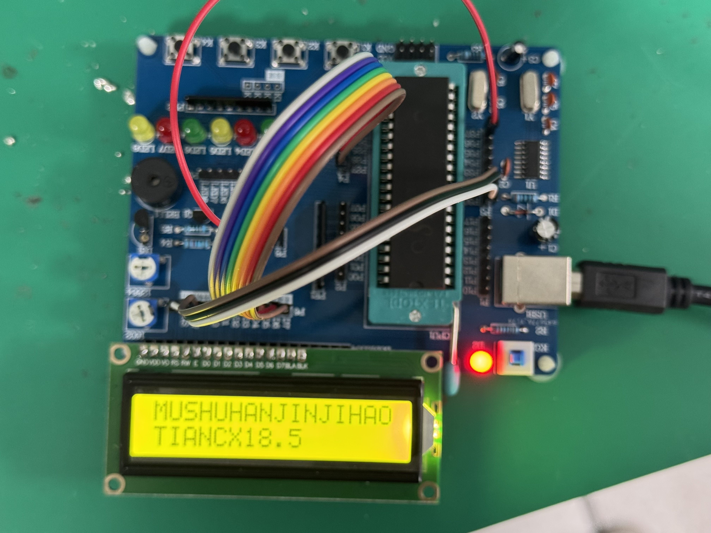

**三、结论及心得体会**

#### **结论**

1. **功能实现：** 本设计基于 AT89S52 单片机、DS18B20 温度传感器和 LCD1206 显示模块，成功实现了温度的实时采集与显示，具有成本低、精度高、操作简单等优点。
2. **性能表现**：
   - DS18B20 提供了稳定可靠的温度测量数据；
   - AT89S52 的处理能力足以应对单任务的实时处理需求；
   - LCD1206 直观地显示温度，增强了用户体验。

#### 心得体会

**设计过程中的收获：**

- 通过本次设计，熟悉了 AT89S52 单片机的基本结构及其与外设的接口通信方法；
- 深入理解了 DS18B20 的单总线协议，对传感器的时序控制有了较好的掌握；
- 学习了 LCD 的初始化和显示控制逻辑，增强了对嵌入式显示技术的理解。
- 初步学习了简单焊接，实现对基础电路的更深层次的了解。

